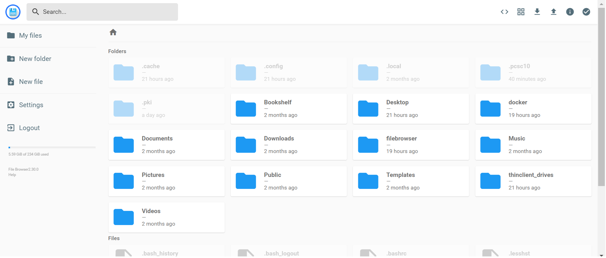

# Filebrowser - Overview

[Filebrowser](https://filebrowser.org/) is a tool that provides an easy to use interface of the computers/network storage system. It allows users to easily navigate, manage, organise, and delete files. It can also create other users and each user will have their own directory.

