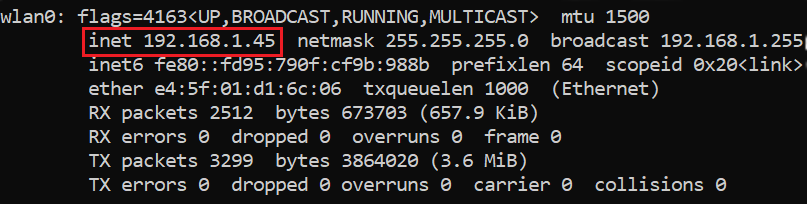

# Post Installation
---
Once you have everything set up, boot up your RPI. Make sure you have internet connection before proceeding. There are 2 method you can proceed with for post installation.

## Graphical User Interface

To use the GUI, ensure your RPI is connected to a monitor, keyboard, and mouse. Check the top right hand corner to ensure you have internet connection.

Click on the console icon to launch a terminal and enter the following command:

```shell
sudo apt update && sudo apt install -y
```

[image of rpi console and command]

## Command Line Interface

To use the CLI, you first need to SSH into your RPI. Go go to your computer's command prompt and enter

```shell
ssh <username>@<RPI IP address>
```

To get your RPI's IP address, you can use the command `ifconfig` in your RPI. Look for your network interface, wlan0 for WiFi and eth0 for Ethernet.



Another method to get your RPI's IP address is by going into your router's webpage and look at the list of connected device. Locate the hostname you have assigned to your RPI and look at the corresponding IP address.

Once you have remotely accessed your RPI, type in the following command:

```shell
sudo apt update && sudo apt install -y
```