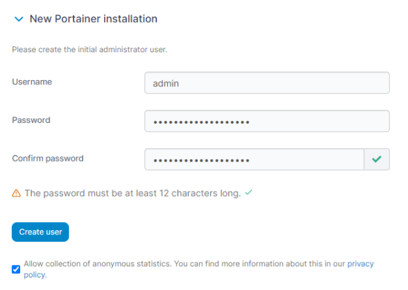
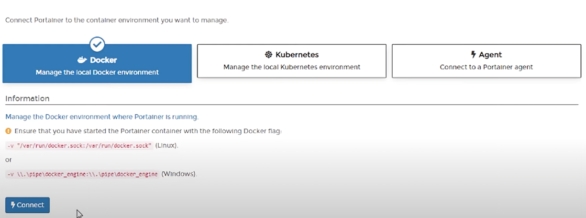
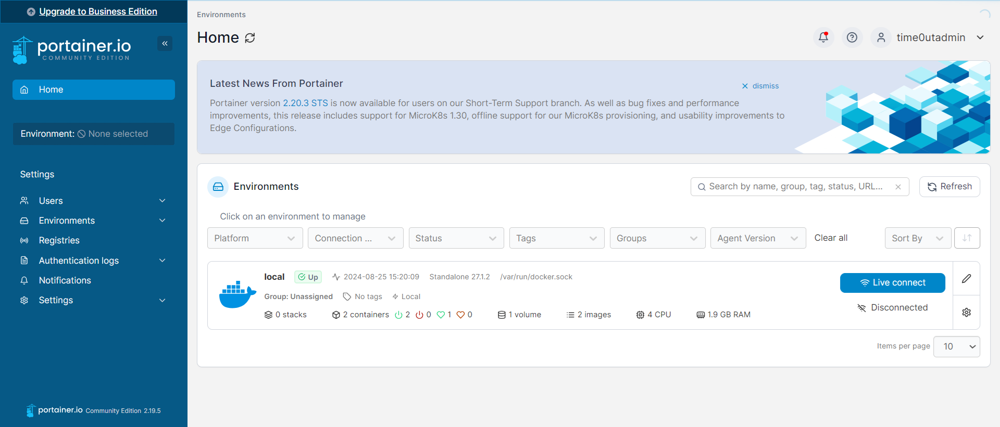
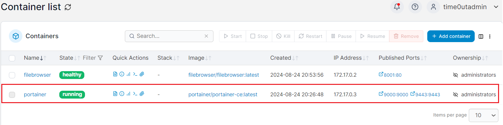
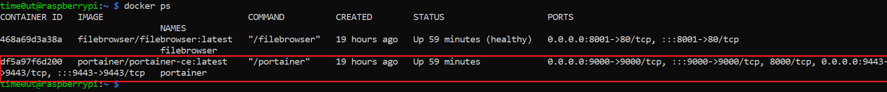

# Portainer

[Portainer](https://www.portainer.io/) is a popular Docker environment management tool. The table below shows unique benefits of portainer.

|Benefit|Description|
|-------|-----------|
|Ease of use|Easy to navigate, useful for users who may not be familiar with command line|
|Role-Base Access Control|Supports user authentication and RBAC|
|Cross Platforms|Can be deployed in various platforms (Linux, Windows, and Mac)|
|Stack Management|Allows for the deployment and management of Docker stacks using Docker Compose files|

## Sign In 

If your installation went by smoothly without any issue, you should see a page (`http://localhost:9000`/`https://localhost:9443`) that allows you to create a user (admin).



It is recommanded to change the default username (admin) to something else. Do enter a secure password as well.

If portainer you to choose the container environment to manage, click on Docker > Connect.



## Simple Guide

Once you have sign in, you will see the home page, which will look something like this.



If you click on the local environment > containers, you will see that portainer is currently being hosted (you should only see portainer).



Another way to see all current containers is using the terminal (You should only see portainer).

```shell
docker ps
```



Do explore portainer as much as you want!

# See also

[Portainer's Universal Container Management Platform](https://www.portainer.io/products/portainer-platform-universal-container-management-platform#:~:text=Why%20Portainer%3F,of%20container%20technologies%20and%20environments.)

[Huge Guide to Portainer for Beginners](https://codeopolis.com/posts/beginners-guide-to-portainer/)