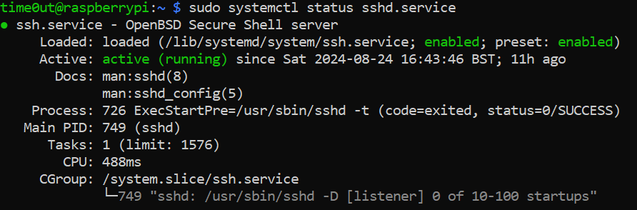
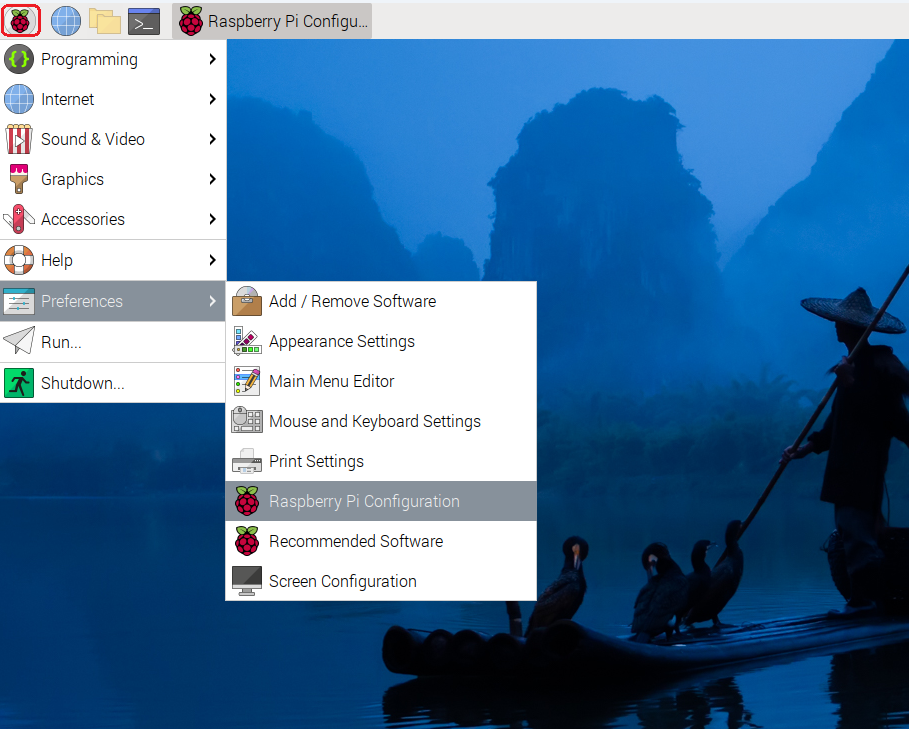
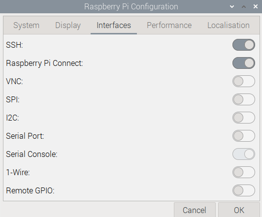
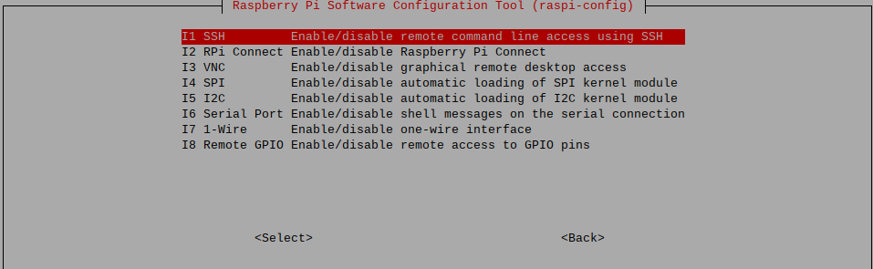

# Methods
---
For this project, we will be using SSH for CLI, and XRDP for GUI remote access. It is recommanded to set up both to have both interface type when remote accessing.

## SSH

Secure Shell (SSH) is a protocol used for securely accessing and managing devices over a network, typically in a command line based environment. It provides encrypted communication and can be use for secure data transfer.

SSH should be enabled on your RPI during the installation of OS. You can check by:

```shell
sudo systemctl status sshd.service
```



If you see this (image above), it means that your SSH service is running. Move on to [XRDP](#xrdp).

If your SSH service is stopped, use the enable command. Enable configure a service to start automatically when the system boots.

```shell
sudo systemctl enable sshd.service
```

If SSH service could not be found, you will have to enable it. I will be providing both the desktop and the terminal method.

### Enable SSH - Desktop

To enable SSH using the desktop interface.

- On the top right corner of your screen, click on the RPI logo > Preferences > Raspberry Pi Configuration



- Go to Interfaces and enable SSH



### Enabling SSH - Terminal

To enable SSH using the terminal.

- Use the command below

```shell
sudo raspi-config
```

- Using the arrow buttons go to Interfacing Options > SSH > Yes (To enable SSH)



### Testing

1. Ensure you are in the same network as your RPI
2. SSH into your RPI (using your RPI IP address)

```shell
ssh <username>@<RPI IP address>
```

## XRDP

XRDP is an open-source implementation of Remote Desktop Protocol (RDP), which enables users to remotely access a graphical desktop environment. XRDP is commonly used in Linux environmentto provide remote access for Windows clients.

### Installing XRDP

- Use the command below to install XRDP

```shell
sudo apt install xrdp -y
```

- Check that XRDP is running

```shell
sudo systemctl status xrdp
```

### Testing

1. Ensure you are in the same network as your RPI
2. Using windows, search for remote desktop connection
3. Key in your RPI IP address
4. Connect

## See also

[How To Easily Transfer Files Over SSH Using SCP](https://cyberpanel.net/blog/transfer-files-over-ssh)