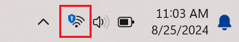

# Technologies/Techniques
---
For this guide, we will be using VPN provided by your router. If your router does not provide VPN, you will have to use [Port Forwarding](#port-forwarding).

## VPN

[Virtual Private Network](https://azure.microsoft.com/en-us/resources/cloud-computing-dictionary/what-is-vpn#:~:text=A%20VPN%2C%20which%20stands%20for,and%20firewalls%20on%20the%20internet.) (VPN) is a techonology that secures and ecnrypts connection over another network. There are many different tunneling protocols such as P2PT, IPsec, LT2P, and more.

1. Access your router's setting page
    - Ensure you are connected to your home WiFi.
    - Find out your computer's default gateway (either by `ifconfig`/`ipconfig` or going into your network settings).
    - Key in the default gateway IP adress into your browser. You should see your router's settig page.
    - Enter credentials
2. VPN Option (Steps may differ)
    - In the settings page, find the VPN option in the menu. (If you cannot find this option, you will have to use [Port Forwarding](#port-forwarding)
    - Configure your router into a VPN server
    - Add your own set of credentials
    - Take note of the tunneling protocol used by your router.
3. Connect to VPN (Windows)
    - Settings > Network & internet > VPN > Add VPN
    - Find out your public [IP address](https://www.whatismyip.com/) (*Your public IP may change once in a while by your ISP*)
    - **server name or address**: Your public IP address
    - **VPN Type**: Protocol used by your router
    - **Username & Password**: Credentials set in your router's setting page

If successful, you will notice that your WiFi logo on the button right corner have an additional shield icon on it.

### Testing

1. Connect to another network (Your mobile data with WiFi turn off/a network outside)
2. Turn on VPN
3. SSH/XRDP into your RPI (using your RPI IP address)

## Port Forwarding

[Port Forwarding](https://en.wikipedia.org/wiki/Port_forwarding) is a network technique that allows external devices to access services on a local network. It will direct traffic from a specific external port on your router to a specific internal IP address and port within your network.

1. Access your router's setting page
    - Ensure you are connected to your home WiFi.
    - Find out your computer's default gateway (either by `ifconfig`/`ipconfig` or going into your network settings).
    - Key in the default gateway IP adress into your browser. You should see your router's settig page.
    - Enter credentials
2. Port Forward Option (Steps may differ)
    - In the settings page, find the Port Forwarding option in the menu.
    - Enter your RPI IP address (You can either `ifconfig` in your RPI or find all connected devices on the router > find RPI hostname)
    - Port forward:
        - RPI IP address - 22/TCP (SSH)
        - RPI IP address - 3389/TCP (XRDP)

### Testing

1. Connect to another network (Your mobile data with WiFi turn off/a network outside)
2. SSH/XRDP into your RPI (using your home public address)

## See Also

[Types of VPNs & Protocols](https://nordlayer.com/learn/vpn/types-and-protocols/)

[What is port forwarding and how safe is it?](https://cybernews.com/what-is-vpn/port-forwarding/)