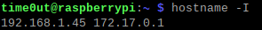
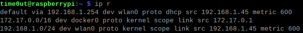
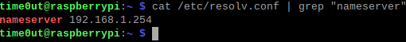

# Static IP
---
Giving your RPI a static IP address is crucial for you to remote access it. Without a static IP address, your RPI IP address will always be changing, making it difficult remote accessing, as you would need to keep track of the new address every time it changes.

There are many methods to make your RPI IP address static, but I will only be listing 2 of them: Reserving a Static IP Address via LAN DHCP & Setting a Static IP Address Directly on the RPI.

## LAN DHCP

This method require you to access your router's setting page. This method makes it such that your router reserves an IP address for your RPI. Everytime your RPI connects to your router, your router will assign that particular IP address to your RPI.

1. Find the menu option for LAN DHCP
2. Enter your preferred IP address for your RPI (within your network range)

## Setting on RPI

Terminal commands will be used for this method.

- Find your current IP address

```shell
hostname -I
```



- Find your router's IP address

```shell
ip r
```



- Find DNS IP address

```shell
cat /etc/resolv.conf | grep "nameserver"
```



- Open /etc/dhcpcd.conf in any editor

```shell
sudo nano /etc/dhcpcd.conf
```

- Add the following lines to the button of the file. If these lines already exist and are not commented out, remove them.

```
interface [INTERFACE]
static_routers=[ROUTER IP]
static domain_name_servers=[DNS IP]
static ip_address=[STATIC IP ADDRESS YOU WANT]/24
```

- For our case, it will be

```
interface wlan0
static_routers=192.168.1.254
static domain_name_servers=192.168.1.254
static ip_address=192.168.1.45/24
```

- Save the file and reboot your RPI